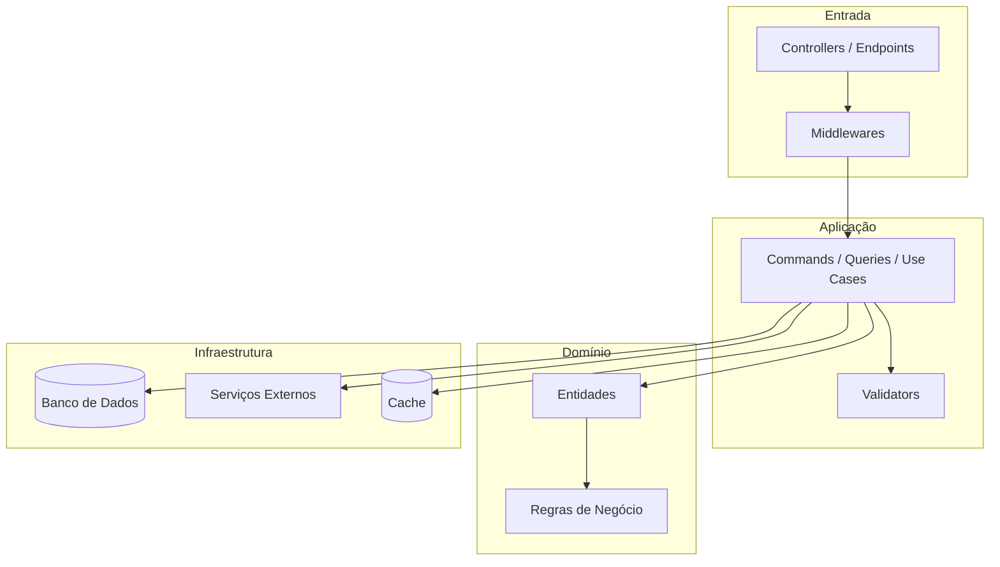
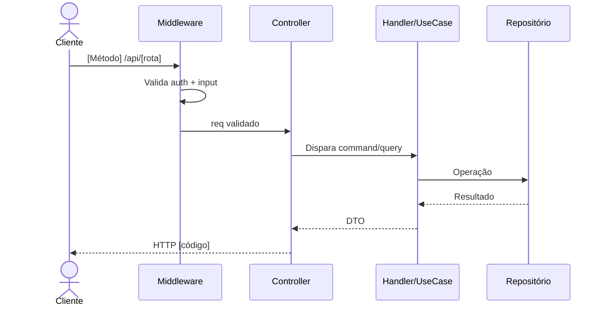
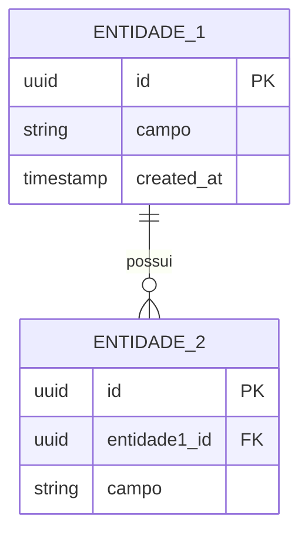
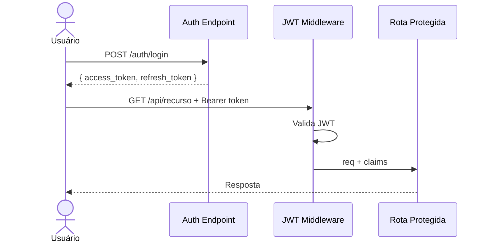
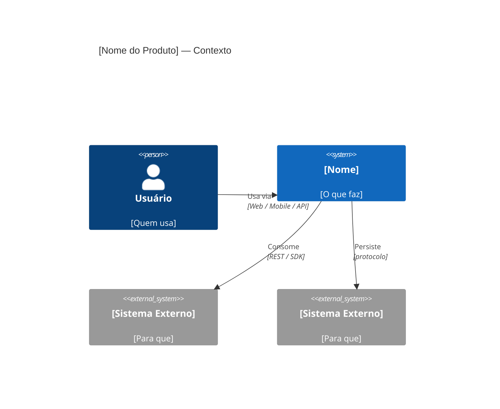
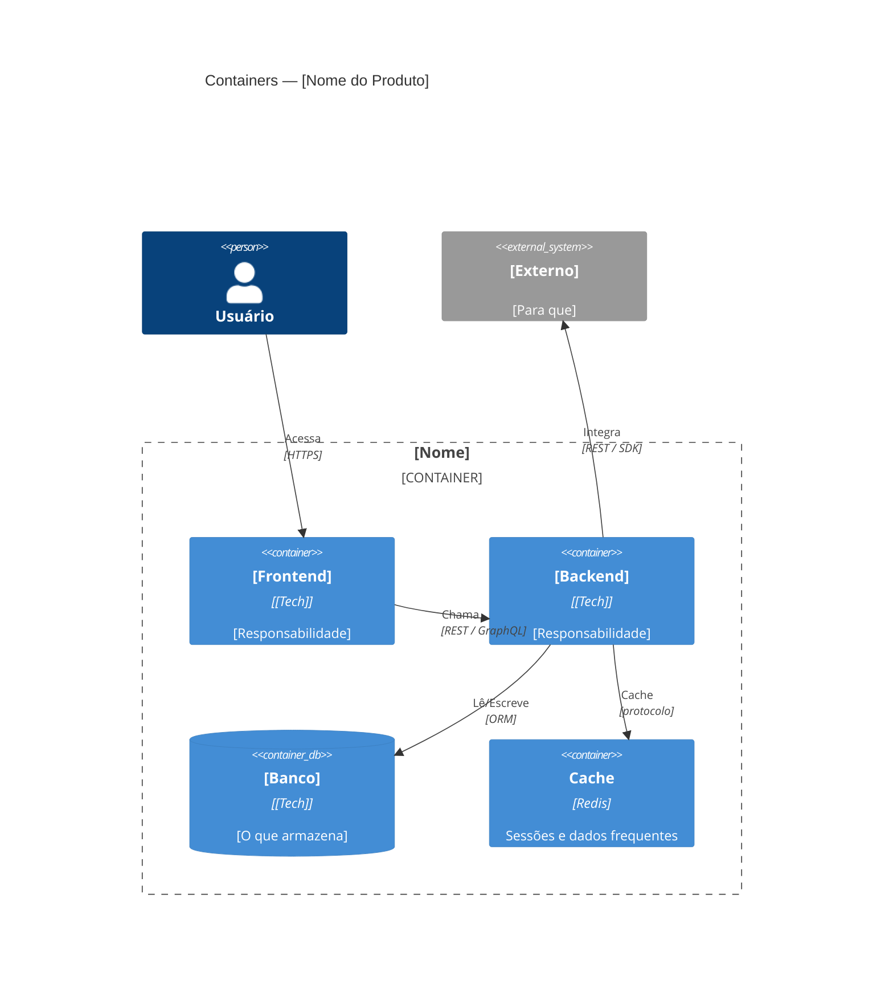
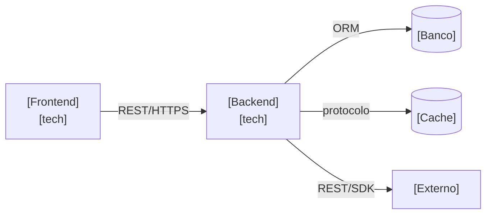
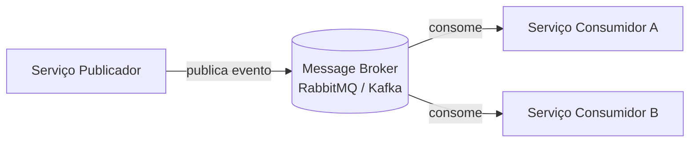
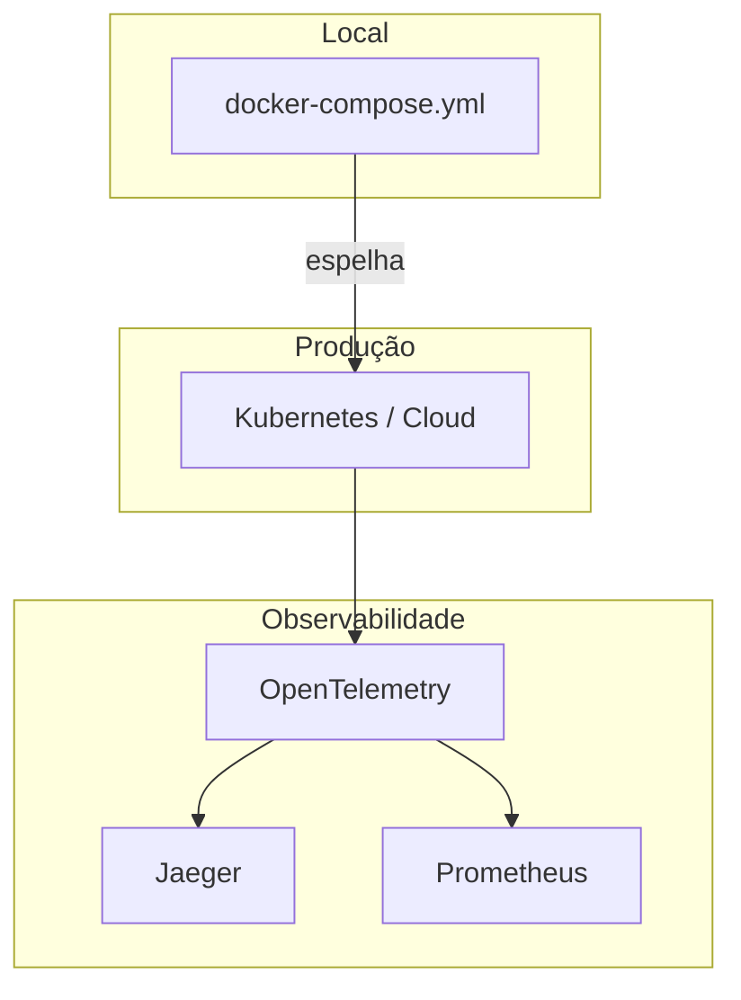

# Tech Doc Generator

Gera documentação técnica padronizada, adaptando estrutura e conteúdo ao tipo de
repositório detectado e ao stack de cada projeto.

**Regra de ouro — ZERO ASCII art:** Nunca use caixas ASCII (`┌─┐ │ └┘ → ▼`) em
nenhum arquivo gerado. Todo diagrama deve ser um bloco ` ```mermaid ``` ` válido.

---

## Passo 1 — Detectar tipo de repositório

```bash
ls -la .
cat package.json 2>/dev/null | python3 -c "
import json,sys
d=json.load(sys.stdin)
print('name:', d.get('name'))
print('workspaces:', d.get('workspaces',''))
" 2>/dev/null
cat pnpm-workspace.yaml 2>/dev/null
cat lerna.json 2>/dev/null
ls apps/ packages/ services/ backend/ frontend/ mobile/ infra/ 2>/dev/null
```

### Critérios de decisão

**É MONOREPO se** qualquer um destes for verdade:
- `package.json` tem campo `workspaces`
- Existe `pnpm-workspace.yaml` ou `lerna.json`
- Existem subpastas separadas por tipo de serviço: `apps/`, `packages/`, `services/`, `backend/` + `frontend/`, `frontend/` + `mobile/`, etc.
- Existe `docker-compose.yml` na raiz orquestrando múltiplos serviços com código-fonte próprio

**É REPO ÚNICO se**:
- Há um único manifesto na raiz (`package.json`, `*.csproj`, `pyproject.toml`, `go.mod`, `Cargo.toml`)
- Pastas organizam módulos internos de uma única aplicação
- Não há separação clara entre serviços distintos

---

## CAMINHO A — Monorepo

### A1 — Mapear os serviços

```bash
for dir in apps/* packages/* services/* backend frontend mobile infra; do
  [ -d "$dir" ] || continue
  echo "=== SERVIÇO: $dir ==="
  ls "$dir"
  [ -f "$dir/package.json" ] && cat "$dir/package.json" | python3 -c "
import json,sys; d=json.load(sys.stdin)
print('  name:', d.get('name'))
print('  scripts:', list(d.get('scripts',{}).keys()))
deps = {**d.get('dependencies',{}), **d.get('devDependencies',{})}
techs = [t for t in ['next','react','vue','angular','express','fastify','nest'] if t in deps]
print('  techs:', techs)
" 2>/dev/null
  find "$dir" -name "*.csproj" 2>/dev/null | head -1 | xargs head -5 2>/dev/null
  [ -f "$dir/pyproject.toml" ] && head -10 "$dir/pyproject.toml"
  [ -f "$dir/go.mod" ] && head -5 "$dir/go.mod"
done

# Infraestrutura na raiz
cat docker-compose.yml 2>/dev/null || cat docker-compose.yaml 2>/dev/null
find . -maxdepth 2 -name "Dockerfile*" | grep -v node_modules
ls infra/ terraform/ k8s/ kubernetes/ 2>/dev/null
```

### A2 — Explorar cada serviço individualmente

Para **cada serviço detectado** (substitua `[svc]` pelo caminho real):

```bash
cat [svc]/package.json 2>/dev/null
cat [svc]/requirements.txt 2>/dev/null || cat [svc]/pyproject.toml 2>/dev/null
find [svc] -name "*.csproj" -exec cat {} \; 2>/dev/null
cat [svc]/go.mod 2>/dev/null

cat [svc]/.env.example 2>/dev/null || cat [svc]/.env.sample 2>/dev/null
grep -rh "process\.env\." --include="*.ts" --include="*.js" [svc] 2>/dev/null \
  | grep -oP 'process\.env\.\w+' | sort -u
grep -rh "os\.environ\|os\.getenv" --include="*.py" [svc] 2>/dev/null \
  | grep -oP '["\x27]\w+["\x27]' | sort -u

find [svc] \( -name "main.*" -o -name "index.*" -o -name "app.*" -o -name "Program.cs" \) \
  | grep -v node_modules | grep -v ".next" | head -8

grep -rl "@router\|@app\.\|Router(\|createRouter\|express()\|MapGet\|MapPost\|@Controller" \
     --include="*.ts" --include="*.js" --include="*.py" --include="*.cs" [svc] 2>/dev/null | head -8

grep -rl "mongoose\|sequelize\|prisma\|typeorm\|sqlalchemy\|drizzle\|DbContext" \
     --include="*.ts" --include="*.js" --include="*.py" --include="*.cs" [svc] 2>/dev/null | head -5
find [svc] \( -name "schema.*" -o -name "*.sql" \) -o -type d -name "migrations" \
  | grep -v node_modules | head -8
```

Leia também: entrypoint, rotas principais, modelos, README existente.

### A3 — Arquivos a gerar

```
[raiz]/
├── README.md              ← visão geral do produto
├── ARCHITECTURE.md        ← como os serviços se conectam
├── [svc-A]/
│   ├── README.md          ← doc técnica do serviço A
│   └── ARCHITECTURE.md   ← arquitetura interna do serviço A
├── [svc-B]/
│   ├── README.md
│   └── ARCHITECTURE.md
└── [svc-N]/...
```

**Gere nesta ordem:** serviços individuais → raiz por último.

---

#### Template: README.md — Serviço individual

```markdown
# [Nome do Serviço]

> [O que este serviço faz — 1 linha]

**Parte do projeto [Nome do Produto]** — visão geral em [`/README.md`](../../README.md)

## Responsabilidade

[1–2 parágrafos: papel deste serviço no sistema, o que faz e o que NÃO faz.]

## Stack

| Camada | Tecnologia | Versão |
|--------|-----------|--------|
| Linguagem | [Nome] | [x.x] |
| Framework | [Nome] | [x.x] |
| Banco de dados | [Nome] | [x.x] |
| [Outras] | [Nome] | [x.x] |

## Pré-requisitos

- [Ferramenta] >= [versão]
- [Serviço externo necessário]

## Setup

```bash
cd [svc]
[instalar dependências]
cp .env.example .env
[migrations se houver]
```

## Variáveis de Ambiente

| Variável | Descrição | Obrigatória | Exemplo |
|----------|-----------|:-----------:|---------|
| `VAR_1` | [O que configura] | ✅ | `valor` |
| `VAR_2` | [O que configura] | ❌ | `padrão` |

## Rodando

```bash
# Desenvolvimento
[comando dev]

# Build
[comando build]

# Testes
[comando test]

# Docker standalone
docker build -t [svc] . && docker run -p [porta]:[porta] [svc]
```

## Estrutura de Pastas

```
[svc]/
├── [pasta]/    # [responsabilidade]
├── [pasta]/    # [responsabilidade]
└── ...
```

[Explique o padrão arquitetural interno]

## [Condicional: Endpoints principais]
<!-- Apenas para serviços backend/API -->

| Método | Rota | Descrição | Auth |
|--------|------|-----------|:----:|
| GET | `/api/[recurso]` | [O que retorna] | ✅ |
| POST | `/api/[recurso]` | [O que faz] | ✅ |

## [Condicional: Banco de dados]
<!-- Apenas se este serviço tiver banco próprio -->

Utiliza **[banco]**. Diagrama de entidades em `ARCHITECTURE.md`.

```bash
[comando de migration]
```

## Contribuindo

```bash
git checkout -b feature/[nome]
[comando de test]
```
```

---

#### Template: ARCHITECTURE.md — Serviço individual

```markdown
# Arquitetura — [Nome do Serviço]

> Arquitetura do sistema completo: [`/ARCHITECTURE.md`](../../ARCHITECTURE.md)
> Setup e uso: [`README.md`](./README.md)

## Padrão Arquitetural

[Descreva o padrão adotado neste serviço e o raciocínio por trás dele.]

## Diagrama de Componentes Internos



## Fluxo de uma Requisição



## [Condicional: Diagrama de Entidades]
<!-- Apenas se tiver banco relacional -->



## [Condicional: Fluxo de Autenticação]
<!-- Apenas se este serviço for responsável por auth -->



## Decisões de Arquitetura

### ADR-001: [Decisão]
- **Status:** Aceito
- **Contexto:** [Por que]
- **Decisão:** [O que]
- **Consequências:** [Trade-offs]

## Segurança

- **Autenticação:** [como é feita]
- **Autorização:** [como roles são controladas]
- **Dados sensíveis:** [tratamento]

## Performance

- [Cache: estratégia]
- [Paginação: implementação]
- [Concorrência: aspectos]
```

---

#### Template: README.md — Raiz do monorepo

```markdown
# [Nome do Produto]

> [O que o produto faz e para quem — 1 linha]

## Sobre

[2–3 parágrafos: contexto do produto, problema que resolve, como os serviços
colaboram em termos de negócio. Não detalhar tecnicamente — isso vai no ARCHITECTURE.md.]

Para arquitetura técnica, veja [ARCHITECTURE.md](./ARCHITECTURE.md).

## Serviços

| Serviço | Responsabilidade | Tech | Docs |
|---------|-----------------|------|------|
| [`[svc-A]`](./[svc-A]) | [O que faz] | [Tech] | [README](./[svc-A]/README.md) |
| [`[svc-B]`](./[svc-B]) | [O que faz] | [Tech] | [README](./[svc-B]/README.md) |

## Subindo o ambiente completo

```bash
# Todos os serviços
docker-compose up

# Individualmente — veja README de cada serviço
```

## Estrutura do Repositório

```
[repo]/
├── [svc-A]/          # [Responsabilidade — tech]
├── [svc-B]/          # [Responsabilidade — tech]
├── docker-compose.yml
└── [configs da raiz]
```

## Contribuindo

Cada serviço tem seu fluxo de desenvolvimento no próprio README.
Convenção de branches: `feature/[svc]/[descrição]` ou `fix/[svc]/[descrição]`
```

---

#### Template: ARCHITECTURE.md — Raiz do monorepo

```markdown
# Arquitetura do Sistema — [Nome do Produto]

> Como os serviços se conectam. Para arquitetura interna de cada serviço,
> veja o `ARCHITECTURE.md` dentro de cada pasta.

## Visão do Sistema

[2–3 parágrafos: padrão geral adotado, como os serviços se comunicam,
trade-offs principais da arquitetura escolhida.]

## Diagrama de Contexto (C4 — Nível 1)



## Diagrama de Containers (C4 — Nível 2)



## Comunicação entre Serviços



## [Condicional: Mensageria / Eventos]
<!-- Inclua se houver RabbitMQ, Kafka, MQTT, SQS etc. -->



## Infraestrutura



## Decisões de Arquitetura do Sistema

### ADR-001: [Decisão sistêmica]
- **Status:** Aceito
- **Contexto:** [Por que]
- **Decisão:** [O que]
- **Consequências:** [Trade-offs]

## Segurança do Sistema

- **Autenticação:** [onde vive e como propaga entre serviços]
- **Comunicação interna:** [mTLS, rede interna, API keys]
- **Secrets:** [como são gerenciados]
```

---

## CAMINHO B — Repo único

### B1 — Exploração completa

```bash
find . -type f | grep -v node_modules | grep -v .git | grep -v __pycache__ \
  | grep -v ".pyc" | grep -v dist | grep -v build | grep -v ".next" \
  | sort | head -120

cat package.json 2>/dev/null
find . -maxdepth 2 -name "*.csproj" -exec cat {} \; 2>/dev/null
cat pyproject.toml 2>/dev/null || cat requirements.txt 2>/dev/null
cat go.mod 2>/dev/null || cat Cargo.toml 2>/dev/null

cat .env.example 2>/dev/null || cat .env.sample 2>/dev/null
grep -rh "process\.env\." --include="*.ts" --include="*.js" . 2>/dev/null \
  | grep -oP 'process\.env\.\w+' | sort -u | head -20
grep -rh "os\.environ\|os\.getenv" --include="*.py" . 2>/dev/null \
  | grep -oP '["\x27]\w+["\x27]' | sort -u | head -20

find . \( -name "main.*" -o -name "index.*" -o -name "app.*" -o -name "Program.cs" \) \
  | grep -v node_modules | grep -v ".next" | head -8

grep -rl "@router\|@app\.\|Router(\|createRouter\|express()\|MapGet\|MapPost\|@Controller" \
     --include="*.ts" --include="*.js" --include="*.py" --include="*.cs" . 2>/dev/null | head -10

grep -rl "mongoose\|sequelize\|prisma\|typeorm\|sqlalchemy\|drizzle\|DbContext" \
     --include="*.ts" --include="*.js" --include="*.py" --include="*.cs" . 2>/dev/null | head -5
find . \( -name "schema.*" -o -name "*.sql" \) -o -type d -name "migrations" \
  | grep -v node_modules | head -8

cat docker-compose.yml 2>/dev/null || cat docker-compose.yaml 2>/dev/null
find . -name "Dockerfile*" | grep -v node_modules
```

Leia: entrypoint principal, rotas, modelos, README existente.

### B2 — Arquivos a gerar

```
[repo]/
├── README.md         ← documentação completa do serviço
└── ARCHITECTURE.md   ← arquitetura interna + contexto externo
```

Use os **mesmos templates do Caminho A — Serviço individual**, com dois ajustes:
- O README pode ter visão geral um pouco mais completa (não há README pai)
- O ARCHITECTURE.md inclui o **Diagrama de Contexto C4 Nível 1** mostrando como este serviço se encaixa nos sistemas externos (outros repos, APIs de terceiros, etc.)

---

## Passo 2 — Detecção de stack por serviço

Para cada serviço (ou projeto único):

| Dimensão | O que detectar |
|---|---|
| **Linguagem** | TypeScript, Python, Java, Go, C#, Rust, Swift, Kotlin... |
| **Framework** | Next.js, FastAPI, Spring, Gin, ASP.NET, Django, NestJS, Flutter... |
| **Padrão arquitetural** | MVC, Clean Architecture, Hexagonal, Feature Folders, CQRS... |
| **Banco** | PostgreSQL, MongoDB, Redis, SQLite, DynamoDB, nenhum... |
| **ORM** | Prisma, EF Core, SQLAlchemy, TypeORM, Drizzle... |
| **Auth** | JWT, OAuth2, API Key, Sessões, nenhuma... |
| **Infra** | Docker, Kubernetes, serverless, bare metal... |
| **Tipo** | API REST, Frontend SPA/SSR, Mobile, CLI, Worker, Biblioteca... |
| **Integrações** | Quais APIs/serviços externos são consumidos |

---

## Passo 3 — Adaptação por tipo de serviço

| Tipo | Seções extras no README | Diagramas extras no ARCHITECTURE.md |
|---|---|---|
| **API REST** | Tabela de endpoints | Sequência por endpoint principal |
| **Frontend SPA/SSR** | Rotas de páginas, componentes-chave | Fluxo de páginas / estado |
| **Mobile** | Build iOS/Android, distribuição | Telas e navegação |
| **Worker/Job** | Triggers, schedule, retry | Fluxo com fila e DLQ |
| **CLI** | Referência de comandos | Módulos internos |
| **Biblioteca/SDK** | API pública, exemplos de uso | Módulos e dependências |
| **Sem banco** | — | Remover entidades |
| **Sem auth** | — | Remover diagrama de auth |
| **Com mensageria** | Tópicos/filas pub/sub | Fluxo de eventos |

---

## Passo 4 — Checklist antes de salvar

**Geral:**
- [ ] Zero placeholders `[entre colchetes]` nos arquivos finais
- [ ] Versões reais nas tabelas de stack
- [ ] Comandos reais (não genéricos)
- [ ] Seções condicionais incluídas ou removidas corretamente

**Monorepo:**
- [ ] Cada serviço tem README.md + ARCHITECTURE.md próprios
- [ ] README da raiz tem tabela de serviços com links
- [ ] ARCHITECTURE.md da raiz mostra conexões, não arquitetura interna
- [ ] Docs de cada serviço referenciam os da raiz (e vice-versa)

**Diagramas:**
- [ ] **ZERO ASCII art** — sem `┌─┐ │ └┘ → ▼` em qualquer arquivo
- [ ] Sintaxe Mermaid válida em todos os blocos
- [ ] Mínimo 2 diagramas Mermaid por ARCHITECTURE.md
- [ ] Monorepo: ARCHITECTURE.md da raiz tem C4 Contexto + C4 Containers

---

## Passo 5 — Salvar os arquivos

**Monorepo — gere serviços primeiro, raiz por último:**
```bash
# Serviço A
cat > [svc-A]/README.md << 'EOF'
[conteúdo]
EOF
cat > [svc-A]/ARCHITECTURE.md << 'EOF'
[conteúdo]
EOF

# (repita para cada serviço)

# Raiz
cat > README.md << 'EOF'
[conteúdo]
EOF
cat > ARCHITECTURE.md << 'EOF'
[conteúdo]
EOF

echo "✅ Docs geradas para: [lista de serviços] + raiz"
```

**Repo único:**
```bash
cat > README.md << 'EOF'
[conteúdo]
EOF
cat > ARCHITECTURE.md << 'EOF'
[conteúdo]
EOF

echo "✅ README.md e ARCHITECTURE.md gerados"
```

---

Ao finalizar, informe ao usuário:
1. Quais arquivos foram criados e onde
2. Ofereça revisar seção específica ou ajustar diagramas
3. Sugira próximos passos: adicionar ao CI, configurar GitHub Pages para as docs, etc.