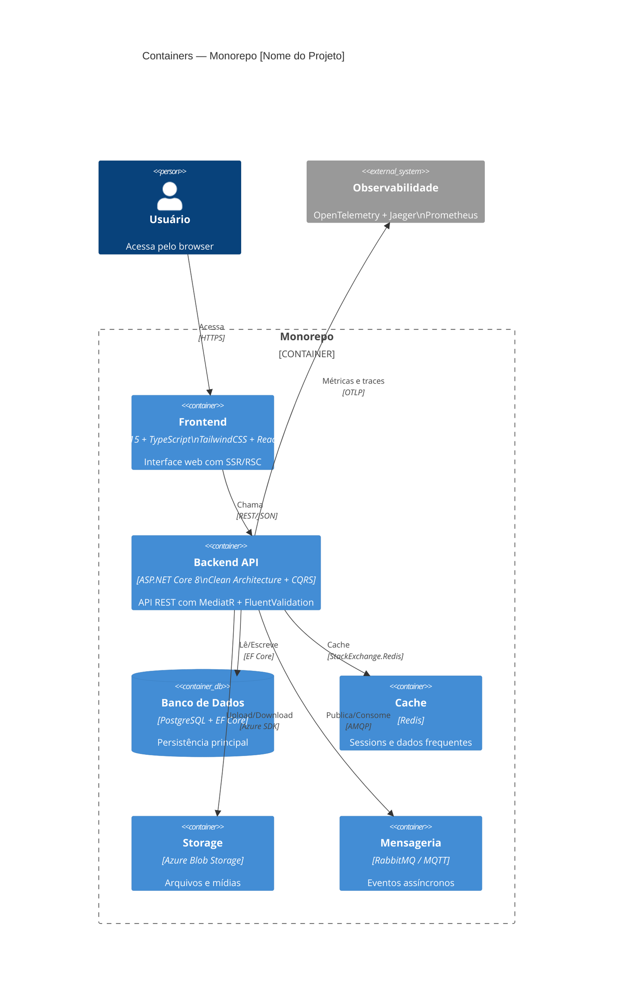
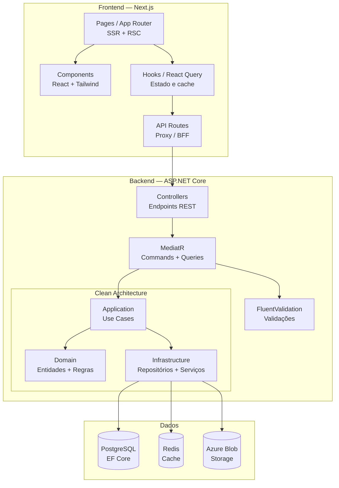
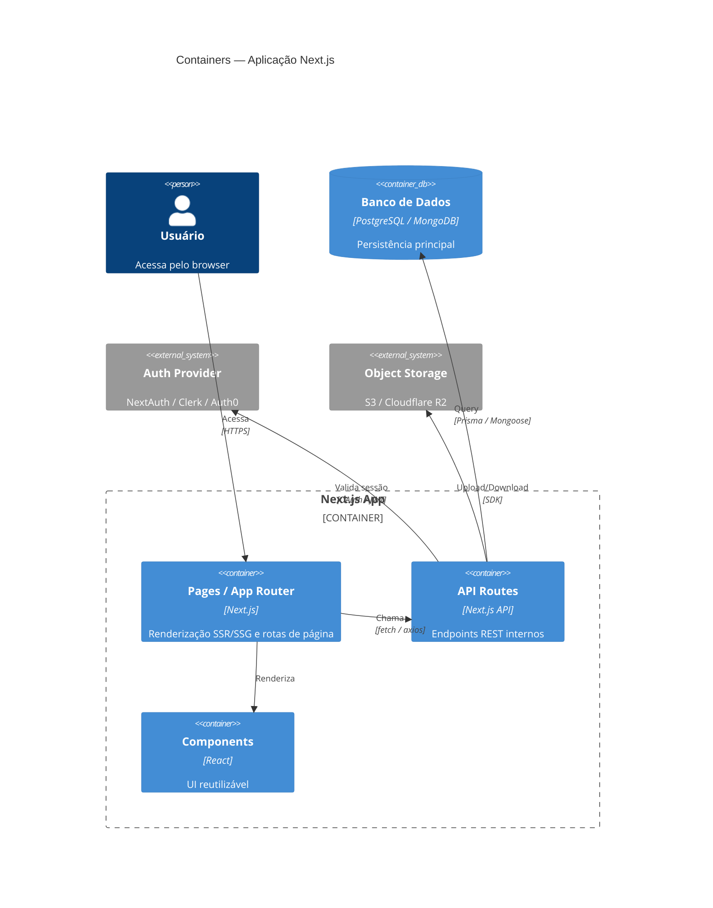
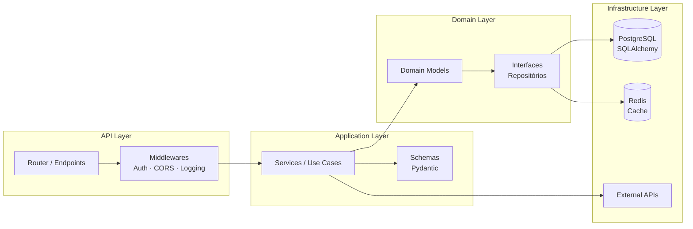
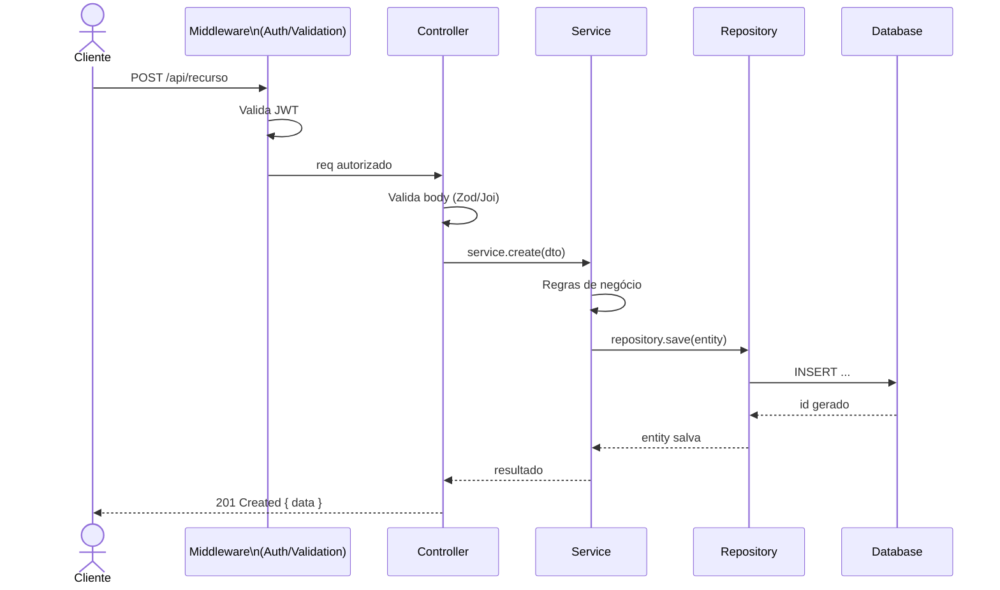
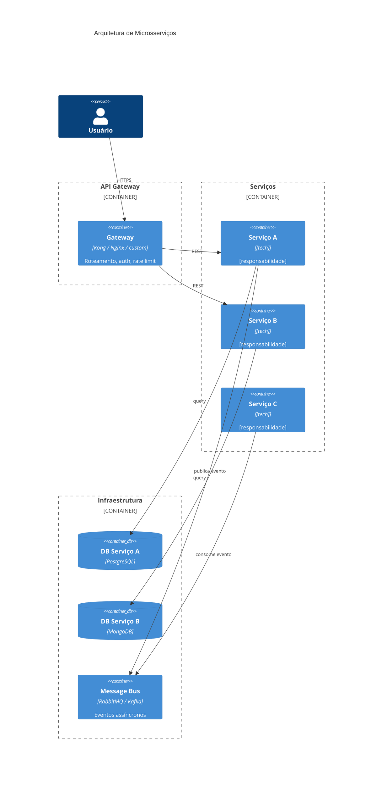
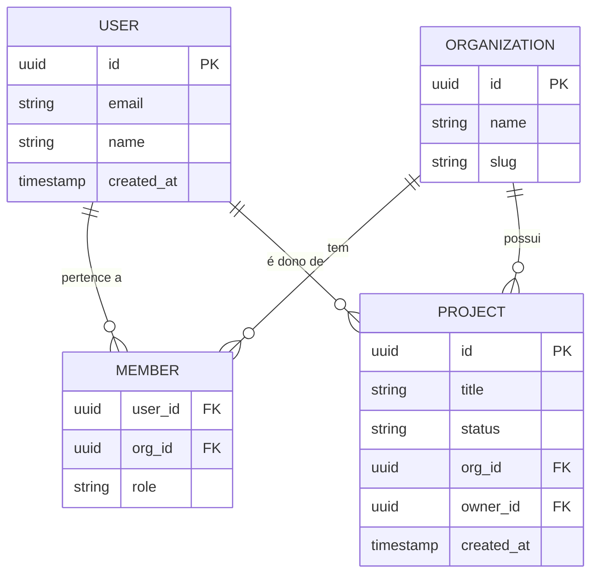
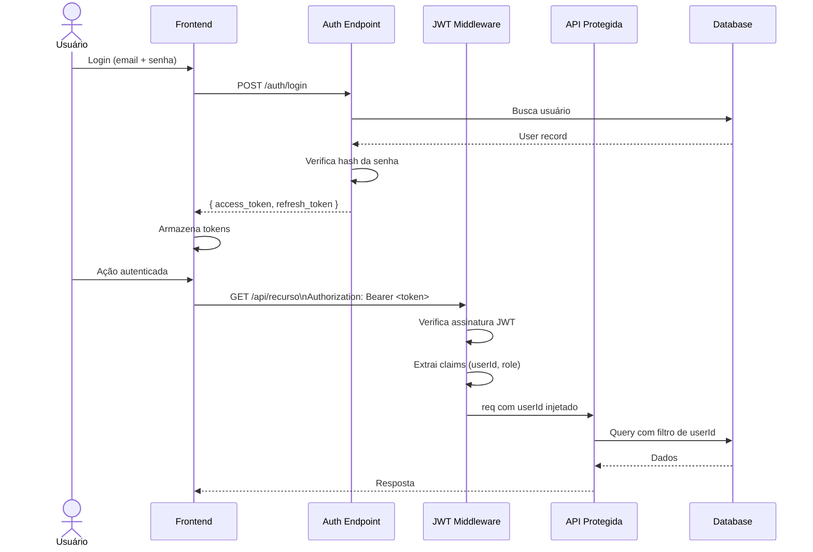
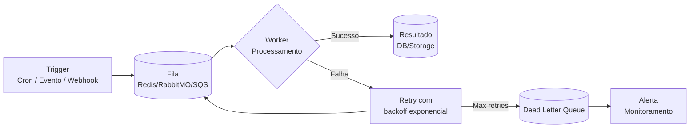

# Referência de Diagramas Mermaid por Stack

> ⚠️ **Nunca use ASCII art** (`┌─┐ │ └┘ → ▼`) em documentação Markdown.
> Sempre converta para blocos Mermaid. Exemplos abaixo.

---

## Monorepo Fullstack — Next.js + ASP.NET Core (Clean Architecture)





---

Use este arquivo como referência ao gerar diagramas no ARCHITECTURE.md.
Copie o exemplo mais próximo do projeto e adapte com os nomes reais.

---

## Next.js / React Fullstack



---

## FastAPI / Python Backend



---

## Node.js / Express REST API



---

## Spring Boot (Java / Kotlin)

```mermaid
graph TD
  subgraph "Presentation"
    REST[REST Controllers\n@RestController]
    DTO[DTOs\nRequest/Response]
  end
  subgraph "Business"
    SVC[Services\n@Service]
    MAPPER[Mappers\nMapStruct]
  end
  subgraph "Data"
    REPO[Repositories\n@Repository / JPA]
    ENTITY[Entities\n@Entity]
  end
  subgraph "Cross-Cutting"
    SEC[Security\nSpring Security + JWT]
    CACHE[Cache\n@Cacheable + Redis]
    EXC[Exception Handler\n@ControllerAdvice]
  end

  REST --> DTO
  REST --> SVC
  SVC --> MAPPER
  SVC --> REPO
  REPO --> ENTITY
  SEC -.-> REST
  CACHE -.-> SVC
  EXC -.-> REST
```

---

## Microsserviços



---

## Diagrama ER (Banco Relacional)



---

## Fluxo de Autenticação JWT



---

## Worker / Job Assíncrono

