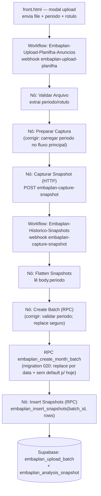

# Upload em múltiplas datas — Design

**Spec:** `.specs/features/upload-multidatas/spec.md`
**Status:** Draft

## Architecture Overview

O fluxo de upload atravessa 3 camadas. O bug está na **perda da `periodo`** entre os nós do workflow de upload e no **`p_replace` fixo em TRUE** combinado com o **default `periodo → hoje`** na RPC. O design corrige a integridade da `periodo` ponta a ponta, torna o `replace` seguro e adiciona uma garantia de unicidade no banco.



---

## Root Cause (evidência)

1. **`Preparar Captura` usa referência cruzada frágil** `$('Validar Arquivo').first().json` e o workflow de upload responde/ramifica de forma assíncrona. Se a referência falhar, `periodo` vira `null`. — `workspaces/Embaplan-Upload-Planilha-Anuncios.json`
2. **`Create Batch (RPC)` envia `p_replace = true` fixo** e `p_periodo = $json.periodo || null`. — `workspaces/Embaplan-Historico-Snapshots.json`
3. **RPC `embaplan_create_month_batch`**: quando `p_periodo` é nulo/vazio, faz `_periodo := NOW()::DATE` (hoje) e, com `p_replace=true`, executa `DELETE FROM embaplan_upload_batch WHERE periodo = _periodo`. Resultado: uploads com `periodo` perdida caem em "hoje" e **substituem** o batch de hoje, e datas anteriores/posteriores são ignoradas. — `migrations/019_chronology_by_period.sql`
4. **DELETE não é escopado por `user_id`** e **não há índice único em `periodo`** (apenas `idx_batch_periodo`, não único). — `migrations/012`, `008`

---

## Code Reuse Analysis

### Componentes existentes a aproveitar

| Componente                                     | Local                                               | Como usar                                                                    |
| ---------------------------------------------- | --------------------------------------------------- | ---------------------------------------------------------------------------- |
| `embaplan_create_month_batch`                  | `migrations/019_chronology_by_period.sql`           | Reescrever via nova migration `020` (CREATE OR REPLACE), mantendo assinatura |
| `embaplan_insert_snapshots`                    | `migrations/008_analysis_snapshots.sql`             | Inalterado; continua recebendo `batch_id` + `rows`                           |
| Nó `Flatten Snapshots`                         | `workspaces/Embaplan-Historico-Snapshots.json`      | Já lê `body.periodo`; manter                                                 |
| Nó `Validar Arquivo`                           | `workspaces/Embaplan-Upload-Planilha-Anuncios.json` | Já extrai `periodo`/`rotulo`; manter                                         |
| Modal de upload + `<input id="uploadPeriodo">` | `front.html` (~6720–6890)                           | Já envia `periodo`/`rotulo`; só endurecer validação/erro                     |
| `idx_batch_periodo`                            | `migrations/012_incremental_monthly.sql`            | Substituir/complementar por índice único parcial                             |

### Integration Points

| Sistema           | Método de integração                                    |
| ----------------- | ------------------------------------------------------- |
| Supabase (RPC)    | Nova migration `020_fix_create_month_batch.sql`         |
| n8n (2 workflows) | Edição de nós Code/HTTP nos JSON e reimport no n8n      |
| Frontend          | Pequeno endurecimento de validação no handler de upload |

---

## Components

### Migration 020 — `embaplan_create_month_batch` robusto

- **Purpose**: garantir que a função nunca substitua um batch de outra data e nunca assuma "hoje" silenciosamente.
- **Location**: `migrations/020_fix_create_month_batch.sql` (novo)
- **Mudanças**:
  - Novo parâmetro de comportamento: se `p_periodo` for nulo/vazio → **levantar EXCEPTION** (`'periodo obrigatório para criar batch'`) em vez de usar `NOW()`. (atende FLOW-03)
  - DELETE de replace escopado por data **e** por usuário: `DELETE ... WHERE periodo = _periodo AND user_id IS NOT DISTINCT FROM p_user_id`. (atende UPDATE-03)
  - Manter normalização `YYYY-MM` → dia 1, `YYYY-MM-DD` → exato; `created_at := _periodo::timestamptz`. (atende UPDATE-02)
  - `GRANT EXECUTE ... TO authenticated;` + `NOTIFY pgrst`.
- **Interfaces**: `embaplan_create_month_batch(p_user_id UUID, p_periodo TEXT, p_rotulo TEXT, p_arquivo_nome TEXT, p_replace BOOLEAN) RETURNS BIGINT` (assinatura inalterada).
- **Reuses**: corpo da versão 019.

### Migration 020 (parte 2) — Unicidade por data

- **Purpose**: impedir duplicatas de `periodo`.
- **Location**: mesma migration `020`.
- **Mudanças**:
  - Consolidar duplicatas existentes: manter o batch de maior `id` por (`periodo`, `user_id`), apagar os demais (cascade remove snapshots órfãos antigos).
  - Criar índice único parcial: `CREATE UNIQUE INDEX uniq_batch_periodo_user ON embaplan_upload_batch (periodo, COALESCE(user_id, '00000000-0000-0000-0000-000000000000'::uuid)) WHERE periodo IS NOT NULL;`
- **Reuses**: substitui o papel de `idx_batch_periodo`.

### Workflow Upload — nó `Preparar Captura`

- **Purpose**: eliminar a perda de `periodo`.
- **Location**: `workspaces/Embaplan-Upload-Planilha-Anuncios.json`
- **Mudanças**: garantir que `periodo`/`rotulo` sejam carregados pelo caminho principal de dados. Se a referência `$('Validar Arquivo')` for mantida, adicionar fallback que falha explicitamente quando `periodo` ausente (não enviar `null` adiante silenciosamente). Validar com `if (!periodo) throw new Error('periodo ausente no upload')`.
- **Reuses**: estrutura atual do nó.

### Workflow Snapshots — nó `Create Batch (RPC)`

- **Purpose**: não substituir indevidamente e não aceitar `periodo` vazia.
- **Location**: `workspaces/Embaplan-Historico-Snapshots.json`
- **Mudanças**: validar `periodo` antes da chamada; manter `p_replace=true` (idempotência por data agora é segura). Garantir que o parâmetro `$2` (p_periodo) seja a `periodo` real.
- **Reuses**: nó Postgres atual.

### Frontend — handler de upload

- **Purpose**: feedback claro e impedir envio sem data.
- **Location**: `front.html` (handler `pendingAction === "uploadSheet"`, ~6840–6900)
- **Mudanças**: se `periodo` vazio, bloquear envio com `setStatus("Selecione a data de referência.", "error")`; tratar resposta de erro do backend exibindo a mensagem.
- **Reuses**: `setStatus`, modal existente.

---

## Data Models

`embaplan_upload_batch` (inalterado estruturalmente):

```
id BIGINT PK
user_id UUID NULL
rotulo TEXT
arquivo_nome TEXT
periodo DATE        -- data de referência escolhida (chave lógica de unicidade)
total_anuncios INT
created_at TIMESTAMPTZ  -- = periodo (migration 019)
```

**Relationships**: `embaplan_analysis_snapshot.batch_id → embaplan_upload_batch.id` (ON DELETE CASCADE).

---

## Error Handling Strategy

| Cenário                        | Tratamento                                   | Impacto ao usuário                                    |
| ------------------------------ | -------------------------------------------- | ----------------------------------------------------- |
| `periodo` ausente na captura   | RPC levanta EXCEPTION; workflow retorna erro | Mensagem "data de referência ausente"; nada é gravado |
| Reenvio da mesma data          | Replace escopado por data+usuário            | Substitui só aquele dia; demais intactos              |
| Data duplicada pré-existente   | Migration consolida antes do índice único    | Transparente; mantém o batch mais recente             |
| `periodo` em formato `YYYY-MM` | Normaliza para dia 1                         | Aceito normalmente                                    |

---

## Tech Decisions

| Decisão                  | Escolha                                      | Racional                                         |
| ------------------------ | -------------------------------------------- | ------------------------------------------------ |
| `periodo` nula na RPC    | Falhar (EXCEPTION) em vez de assumir hoje    | Evita substituição acidental — causa raiz do bug |
| Escopo do replace        | Por `periodo` + `user_id`                    | Não apaga batches de outras datas/usuários       |
| Unicidade                | Índice único parcial em `(periodo, user_id)` | Garante 1 batch por data; defesa em profundidade |
| Manter assinatura da RPC | Sim                                          | Não quebra os nós n8n existentes                 |

---

## CONCERNS.md — mitigações

- **Ingestão frágil (parsing de planilha):** esta feature não altera o parsing, mas adiciona validação de `periodo`. Risco residual mantido em CONCERNS.md.
- **Sem testes automatizados:** introduzir verificação manual roteirizada (UAT) nas tasks; recomendar pgTAP futuramente (M3).
- **DELETE não escopado por usuário:** corrigido nesta feature (escopo por `user_id`).
