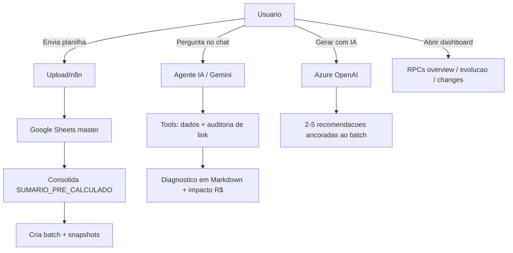
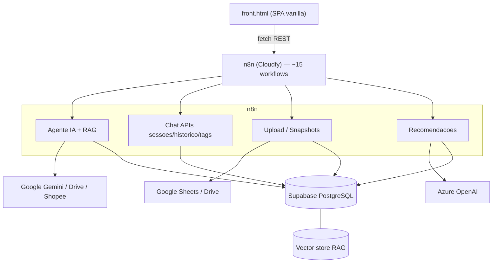
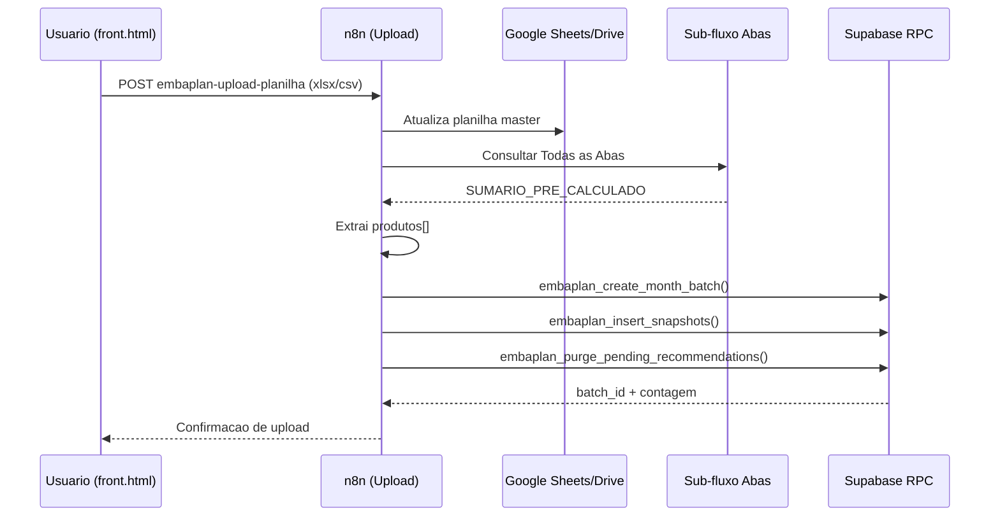
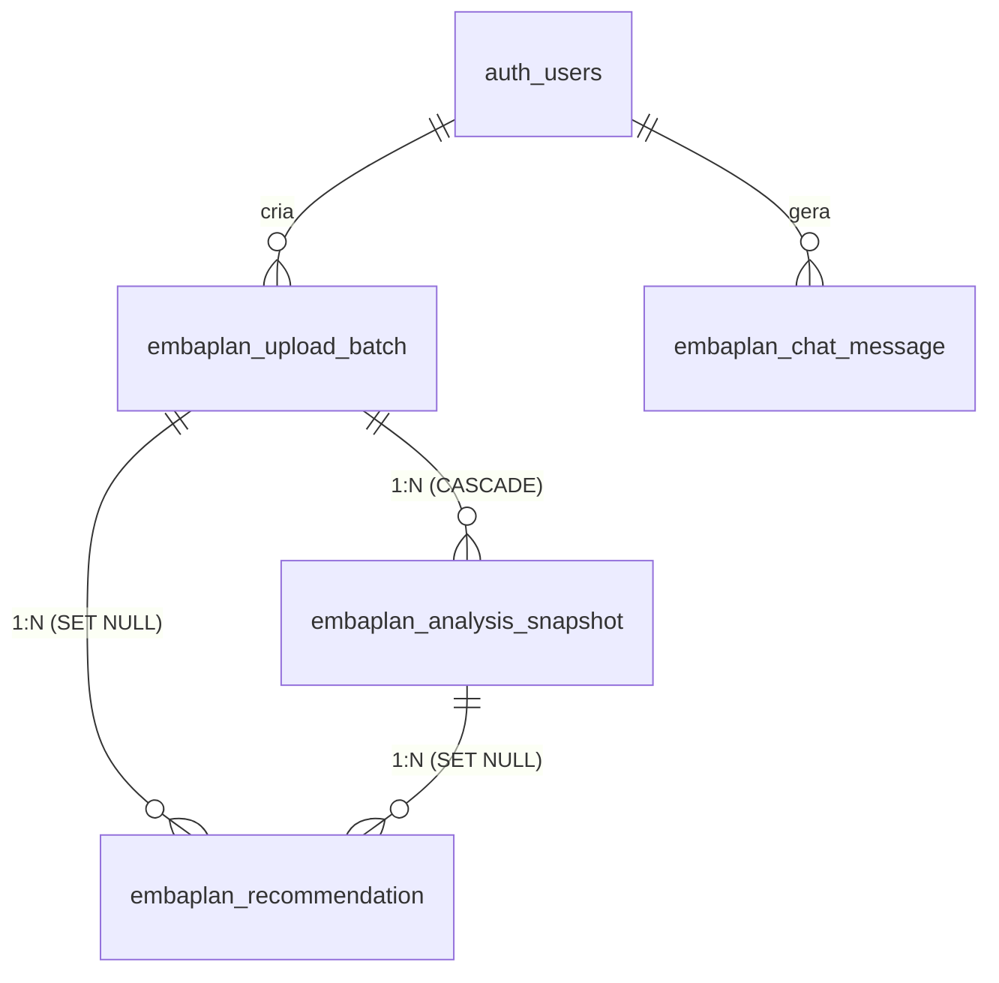

# Embaplan — Documentação Técnica e de Negócio

**Plataforma de inteligência para anúncios de marketplace (Shopee Ads)**

Versão do documento: 1.0 · Data: 24/06/2026 · Autor: Doc Master

---

## Sumário Executivo

O **Embaplan** é uma plataforma de inteligência para gestão de anúncios em marketplace (foco em **Shopee Ads**) que transforma planilhas mensais de desempenho em **análises**, **histórico evolutivo versionado** e **recomendações acionáveis geradas por IA**, sempre com **impacto financeiro estimado em R$**.

O público-alvo são **analistas e gestores de tráfego/e-commerce** que operam anúncios na Shopee e precisam decidir onde **escalar, pausar ou otimizar** campanhas. O produto substitui a leitura manual de planilhas extensas (ROAS, ACOS, lucro, conversão) por um **dashboard com KPIs**, **comparação entre lojas e períodos** e um **agente de IA conversacional** que audita anúncios usando dados reais — com regras rígidas anti-alucinação.

**Stack em uma frase:** frontend SPA single-file (`front.html`, HTML/CSS/JS vanilla) → backend orquestrado em **n8n** (webhooks REST) → **Supabase/PostgreSQL** com a lógica de negócio em funções RPC `SECURITY DEFINER`, somado a **Google Sheets/Drive**, **Google Gemini** (chat) e **Azure OpenAI** (recomendações).

> [!NOTE]
> Esta documentação foi gerada por engenharia reversa do repositório (código-fonte, migrations SQL e workflows n8n). Afirmações inferidas estão marcadas com `(inferido)`. Itens não localizados no código são registrados como "não identificado".

---

## 1. Visão de Negócio

### 1.1 Propósito e problema resolvido

Operar anúncios em marketplaces gera planilhas extensas e de difícil interpretação. O analista precisa cruzar dezenas de métricas (ROAS, ACOS, lucro, margem, conversão, CTR, ticket médio) por anúncio, por produto e por loja, e ainda acompanhar a **evolução ao longo do tempo** para saber se as ações tomadas deram certo.

O Embaplan resolve isso ao:

- **Ingerir planilhas mensais** e manter um **histórico versionado por período** (batches idempotentes), permitindo comparar "antes vs. depois".
- Oferecer um **agente de IA conversacional** que audita anúncios a partir de **dados reais** (sem alucinar) e gera recomendações priorizadas com **impacto em R$**.
- Disponibilizar um **dashboard analítico** com KPIs, alertas de anúncios críticos, comparação entre lojas e evolução do portfólio.

### 1.2 Atores e papéis

| Ator                              | Papel                    | Permissões / Escopo                                                                                   | Origem no código                                                |
| --------------------------------- | ------------------------ | ----------------------------------------------------------------------------------------------------- | --------------------------------------------------------------- |
| **Administrador** (`admin`)       | Gestão completa          | Pode gerenciar usuários, papéis, batches e operações administrativas; gated por `embaplan_is_admin()` | `raw_user_meta_data->>'role'`; migration `003_admin_guards.sql` |
| **Visualizador** (`visualizador`) | Consulta/operação padrão | Acessa chat, dashboard, upload e recomendações; sem operações admin                                   | Papel default em `002_add_roles.sql`                            |
| **Agente de IA** (sistema)        | Consultor automatizado   | Audita anúncios e gera recomendações via tools; não é um login humano                                 | `Embaplan - Agent IA.json`                                      |

> [!WARNING]
> No estado atual, o login do `front.html` usa credenciais fixas (`admin`/`admin`) com token estático em `localStorage`, **independente** do modelo de papéis já existente no banco. Trata-se de débito de segurança conhecido — ver seção 5.8 e a seção 7.

### 1.3 Jornadas / fluxos principais

**Jornada A — Upload de planilha e versionamento**

1. O usuário envia uma planilha (Excel/CSV) pela UI ("Enviar Planilha").
2. O workflow valida o arquivo e atualiza a planilha master no Google Sheets/Drive.
3. O sub-fluxo "Consultar Todas as Abas" consolida um `SUMARIO_PRE_CALCULADO`.
4. Cada upload vira **um batch** (versão/mês); cada anúncio vira **um snapshot append-only**.
5. Recomendações pendentes baseadas em dados antigos são purgadas.

**Jornada B — Chat com o agente de IA**

1. O usuário faz uma pergunta no chat (ex.: "analise a Base A4").
2. O agente carrega memória (últimas 10 mensagens) e chama tools de dados e auditoria de link.
3. O agente devolve um diagnóstico estruturado em Markdown (streaming), com ações priorizadas e impacto em R$.

**Jornada C — Geração de recomendações de IA**

1. O usuário aciona "Gerar com IA" para um produto/anúncio.
2. O sistema monta o contexto (estado atual + histórico + recomendações existentes).
3. O Azure OpenAI gera de 2 a 5 recomendações com impacto em R$, ancoradas ao batch corrente.
4. O usuário marca status (feito/descartado); na versão seguinte o sistema avalia se a sugestão funcionou.

**Jornada D — Dashboard e evolução**

1. O usuário abre o dashboard e navega pelas abas (Visão Geral, Alertas, Comparar, Oportunidades, Evolução).
2. Os KPIs e séries vêm de RPCs de overview, evolução e detecção de mudanças entre batches.



### 1.4 Regras de negócio

| Regra                              | Descrição                                                                                                         | Origem no código                                         |
| ---------------------------------- | ----------------------------------------------------------------------------------------------------------------- | -------------------------------------------------------- |
| Idempotência de batch mensal       | Upload com o mesmo `periodo` substitui o batch anterior (`p_replace`)                                             | `embaplan_create_month_batch` (migrations 018/020)       |
| Histórico append-only              | Cada anúncio gera 1 snapshot por batch; nada é sobrescrito dentro do batch                                        | `008_analysis_snapshots.sql`                             |
| Cálculo de tendência               | `LAG()` compara saúde/lucro/ACOS vs. batch anterior → `novo`/`evoluindo`/`piorando`/`estavel`                     | `embaplan_ad_timeline`, `embaplan_latest_overview` (008) |
| Purga de recomendações pendentes   | Ao subir nova planilha, recomendações `pendente` do agente são apagadas; tratadas (feito/descartado) são mantidas | `embaplan_purge_pending_recommendations` (018)           |
| Avaliação de eficácia              | Na versão seguinte, compara-se a `metrica_alvo` para classificar resultado (`funcionou`/`neutro`/`piorou`)        | `embaplan_evaluate_recommendations` (009/010/014)        |
| Classificação de status do anúncio | 🚀 Escalável / ⏳ Maturação / ⚠️ Gargalo / 🛑 Ralo conforme limiares de Conv/ACOS/Lucro/CTR                       | Prompt do agente, `Embaplan - Agent IA.json`             |
| Impacto sempre em R$               | Toda recomendação/ação deve declarar economia/retorno estimado em R$ e a base do cálculo                          | Prompt do agente (Regra 6)                               |
| Anti-alucinação                    | Proibido inventar métricas, indexação ou snippets; usar apenas dados reais do sumário/tool                        | Prompt do agente (Proibições absolutas)                  |
| Validação numérica                 | Soma de vendas/receita dos cards deve bater com o total do sumário (tolerância definida)                          | Prompt do agente                                         |
| Segregação por loja                | Não somar receita/vendas entre lojas; índice prefixado por loja (`L2#47`) evita colisão                           | Prompt do agente; `embaplan_extract_link`                |
| Ordenação por período              | Ordenar por `COALESCE(periodo, created_at::date)`, não pelo timestamp de upload                                   | migration 019                                            |

### 1.5 Entidades de domínio (glossário)

- **Batch (lote/versão):** uma rodada de upload, equivalente a um período (mês). Base da comparação temporal.
- **Snapshot:** fotografia das métricas de um anúncio em um batch específico (append-only).
- **Anúncio (campanha):** unidade de veiculação identificada por `anuncio_indice` (ex.: `L2#47`), prefixada pela loja.
- **Produto (linha):** agrupamento de anúncios do mesmo item (ex.: "Base de Corte — A4 (Loja 2)").
- **Loja:** unidade de negócio na Shopee, mapeada a um `shop_id` (1→457463719, 2→1020574907, 3→959503392).
- **Recomendação:** sugestão de otimização (origem `agente` ou `usuario`), com `metrica_alvo`, `status` e `resultado`.
- **Métricas de saúde:** `saude` (0–10), `roas`, `acos`, `lucro`, `receita`, `ctr`, `conversao`, `ticket_medio`, `margem_liquida`, `roi`.

---

## 2. Visão Técnica

### 2.1 Stack e dependências

| Camada               | Tecnologia                                                                 | Observações                                                       |
| -------------------- | -------------------------------------------------------------------------- | ----------------------------------------------------------------- |
| Frontend             | HTML/CSS/JS vanilla (`front.html`, ~10.900 linhas)                         | Sem framework; servido via webhook n8n (`/webhook/embaplan-chat`) |
| Libs frontend (CDN)  | `marked@4.3.0`, `highlight.js 11.9.0`, `lucide@latest`, Google Fonts Inter | Dependências remotas voláteis (ver Concerns)                      |
| Orquestração/Backend | n8n self-hosted (Cloudfy)                                                  | ~15 workflows expondo webhooks REST                               |
| Banco/Auth/Vector    | Supabase (PostgreSQL)                                                      | Lógica em RPC `SECURITY DEFINER`; vector store para RAG           |
| LLM de chat          | Google Gemini 3 Pro (`models/gemini-3-pro-preview`)                        | Agente LangChain no n8n; temperatura ~0.4                         |
| LLM de recomendações | Azure OpenAI (`gpt-5.4-mini`)                                              | Geração de recomendações com impacto em R$                        |
| Dados/arquivos       | Google Sheets + Google Drive (OAuth2)                                      | Fonte de verdade dos dados e base RAG                             |
| Marketplace          | Shopee (BR)                                                                | Geração de link + auditoria por scraping (SERP)                   |

### 2.2 Arquitetura geral

Padrão **Backend-as-Workflows**: não há servidor de aplicação tradicional. Todo o backend é composto por webhooks n8n que invocam funções RPC PostgreSQL no Supabase. A UI é uma SPA single-file.



### 2.3 Estrutura de pastas

```text
embaplan/
├── front.html                 # SPA completa (chat + dashboard)
├── migrations/                # Schema + funções RPC (SQL versionado 001–020)
├── workspaces/                # Workflows n8n exportados (JSON) — fonte de verdade do backend
├── RAG/                       # Base de conhecimento (Playbook Analista Shopee Ads.pdf)
├── data/                      # Planilhas de exemplo (*.xlsx)
└── .specs/                    # Documentação spec-driven (codebase + projeto + features)
```

Limites de módulo: definidos pelo prefixo `embaplan_` no banco e pelo nome do workflow (`Embaplan-<Feature>`). Acoplamento entre workflows ocorre apenas via webhooks e sub-fluxos (`toolWorkflow`).

### 2.4 Fluxo de uma operação ponta a ponta (upload → snapshots)



### 2.5 API / Webhooks (n8n)

Base URL: `https://longflatworm-n8n.cloudfy.live/webhook`

| Grupo     | Endpoint                                                                | Método   | Função                               |
| --------- | ----------------------------------------------------------------------- | -------- | ------------------------------------ |
| Frontend  | `embaplan-chat`                                                         | GET      | Serve o `front.html`                 |
| Saúde     | `embaplan_health`                                                       | GET      | Health check (polling do front)      |
| Chat/IA   | `embaplan-AgentRag`                                                     | POST     | Entrada do agente IA (streaming)     |
| Chat/IA   | `embaplan-index-drive`                                                  | POST     | Upload de arquivo para indexação RAG |
| Chat/IA   | `embaplan-prune-history`                                                | POST     | Limpa histórico antigo/editado       |
| Sessões   | `embaplan-sessions`                                                     | GET      | Lista sessões                        |
| Sessões   | `embaplan-history?sessionId=`                                           | GET      | Histórico de uma sessão              |
| Sessões   | `embaplan-session?sessionId=`                                           | DELETE   | Exclui sessão                        |
| Tags      | `embaplan-add-tag` / `embaplan-remove-tag`                              | POST     | Adiciona/remove tag                  |
| Tags      | `embaplan-list-tags` / `embaplan-session-tags`                          | GET      | Lista tags / tags da sessão          |
| Tags      | `embaplan-rename-tag` / `embaplan-delete-tag` / `embaplan-autocomplete` | POST/GET | Renomeia/exclui/autocompleta         |
| Planilhas | `embaplan-upload-planilha`                                              | POST     | Upload de Excel/CSV                  |
| Planilhas | `embaplan-capture-snapshot`                                             | POST     | Captura snapshot dos anúncios        |
| Batches   | `embaplan-batches`                                                      | GET      | Lista versões/batches                |
| Batches   | `embaplan-batch-update` / `embaplan-batch-delete`                       | POST     | Edita/exclui batch                   |
| Batches   | `embaplan-detect-changes`                                               | POST     | Compara dois batches                 |
| Analytics | `embaplan-ad-timeline?indice=`                                          | GET      | Série temporal de um anúncio         |
| Analytics | `embaplan-overview?loja=`                                               | GET      | Visão geral do dashboard             |
| Analytics | `embaplan-portfolio-evolution`                                          | GET      | Evolução do portfólio                |
| Recom.    | `embaplan-recommendations`                                              | GET      | Recomendações de um produto          |
| Recom.    | `embaplan-generate-recommendations`                                     | POST     | Gera recomendações via IA            |
| Recom.    | `embaplan-add-recommendations`                                          | POST     | Adiciona recomendações manuais       |
| Recom.    | `embaplan-recommendation-status`                                        | POST     | Atualiza status                      |
| Recom.    | `embaplan-recommendation-delete`                                        | POST     | Exclui recomendação                  |
| Admin     | `embaplan-user-change`                                                  | POST     | Altera usuário/papel                 |
| Admin     | `embaplan-DatabaseSetup`                                                | POST     | Inicializa/reseta o banco            |

> [!DANGER]
> Os webhooks são públicos e não apresentam validação de origem/assinatura no front. Endpoints destrutivos/admin (`embaplan-DatabaseSetup`, `embaplan-batch-delete`, `embaplan-user-change`) podem, em tese, ser chamados diretamente. Ver seção 7.

### 2.6 Modelo de dados

Tabelas principais com prefixo `embaplan_*`. A lógica de negócio reside em funções RPC `SECURITY DEFINER`.

**`embaplan_upload_batch`** — um registro por upload (versão/mês).

| Coluna           | Tipo                 | Notas                                  |
| ---------------- | -------------------- | -------------------------------------- |
| `id`             | BIGINT IDENTITY (PK) | —                                      |
| `user_id`        | UUID                 | autor do upload                        |
| `rotulo`         | TEXT                 | rótulo amigável                        |
| `periodo`        | DATE                 | mês de referência (migrations 016–020) |
| `arquivo_nome`   | TEXT                 | nome do arquivo                        |
| `total_anuncios` | INTEGER              | preenchido após inserir snapshots      |
| `created_at`     | TIMESTAMPTZ          | —                                      |

**`embaplan_analysis_snapshot`** — fotografia de um anúncio em um batch (append-only).

| Coluna                                                                      | Tipo                 | Notas               |
| --------------------------------------------------------------------------- | -------------------- | ------------------- |
| `id`                                                                        | BIGINT IDENTITY (PK) | —                   |
| `batch_id`                                                                  | BIGINT FK → batch    | `ON DELETE CASCADE` |
| `loja`, `produto`, `titulo`, `status`                                       | TEXT                 | identificação       |
| `anuncio_indice`                                                            | TEXT (NOT NULL)      | ex.: `L2#47`        |
| `saude`                                                                     | NUMERIC(4,1)         | 0–10                |
| `vendas`, `receita`, `lucro`, `investimento_ads`                            | NUMERIC              | financeiro          |
| `acos`, `ctr`, `conversao`, `roas`, `roi`, `margem_liquida`, `ticket_medio` | NUMERIC              | performance         |
| `metrics_jsonb`                                                             | JSONB                | métricas brutas     |
| `created_at`                                                                | TIMESTAMPTZ          | —                   |

**`embaplan_recommendation`** — recomendações e avaliação de eficácia.

| Coluna                      | Tipo                       | Notas                                       |
| --------------------------- | -------------------------- | ------------------------------------------- |
| `id`                        | BIGINT IDENTITY (PK)       | —                                           |
| `batch_id`                  | BIGINT FK → batch          | `ON DELETE SET NULL`                        |
| `snapshot_id`               | BIGINT FK → snapshot       | `ON DELETE SET NULL`                        |
| `anuncio_indice`            | TEXT (NOT NULL)            | —                                           |
| `origem`                    | TEXT                       | `agente` \| `usuario`                       |
| `texto`                     | TEXT                       | conteúdo da sugestão                        |
| `prioridade`                | INTEGER                    | 1 = urgente                                 |
| `metrica_alvo`              | TEXT                       | métrica que se quer melhorar                |
| `status`                    | ENUM `embaplan_rec_status` | `pendente` \| `feito` \| `descartado`       |
| `resultado`                 | TEXT                       | `funcionou` \| `neutro` \| `piorou` \| NULL |
| `resultado_batch_id`        | BIGINT FK → batch          | batch de avaliação                          |
| `created_at` / `updated_at` | TIMESTAMPTZ                | `updated_at` via trigger                    |

**Outras tabelas:** `embaplan_chat_message` (memória LangChain, com trigger `trg_chat_set_user_id`) e `embaplan_chat_tags` (tags de sessão). Autenticação e papéis residem em `auth.users` (`raw_user_meta_data->>'role'`).



### 2.7 Funções RPC-chave

| Função                                                            | Propósito                                                 |
| ----------------------------------------------------------------- | --------------------------------------------------------- |
| `embaplan_create_month_batch(...)`                                | Cria/atualiza batch do mês (idempotente via `p_replace`)  |
| `embaplan_insert_snapshots(batch_id, rows)`                       | Bulk insert de snapshots; atualiza `total_anuncios`       |
| `embaplan_ad_timeline(indice, limit)`                             | Série temporal de um anúncio com deltas e tendência       |
| `embaplan_latest_overview(loja)`                                  | Estado atual de todos os anúncios (último batch)          |
| `embaplan_portfolio_evolution(loja, produto)`                     | Métricas agregadas por batch para a aba Evolução          |
| `embaplan_list_batches()`                                         | Lista batches com contagem de anúncios e recomendações    |
| `embaplan_update_batch(id, periodo, rotulo)`                      | Edita data/rótulo de um batch                             |
| `embaplan_delete_batch(id)`                                       | Remove batch (snapshots em cascata; limpa recs pendentes) |
| `embaplan_purge_pending_recommendations(...)`                     | Purga recomendações pendentes ao subir nova planilha      |
| `embaplan_add_recommendations(batch, user, rows)`                 | Registra recomendações em lote                            |
| `embaplan_evaluate_recommendations(...)`                          | Avalia eficácia comparando a métrica-alvo entre batches   |
| `embaplan_admin_list_users()` / `embaplan_admin_update_user(...)` | Gestão de usuários/papéis (admin)                         |
| `embaplan_is_admin()`                                             | Guard de autorização para operações admin                 |
| `embaplan_extract_link(...)`                                      | Gera link Shopee a partir de loja/título/ID               |

### 2.8 Integrações externas

- **Supabase (PostgreSQL):** banco, auth, lógica RPC e vector store. Credencial n8n `Supabase_database`.
- **Google Sheets (OAuth2):** fonte de verdade dos dados; enumeração de abas. Credencial `Google Sheets account`.
- **Google Drive (OAuth2):** versões de planilha e documentos para RAG. Credencial `Google Drive account`.
- **Google Gemini 3 Pro:** agente IA de chat. Credencial `Google Gemini(PaLM) Api account 2`.
- **Azure OpenAI (`gpt-5.4-mini`):** geração de recomendações. Credencial `Azure Open AI account 3`.
- **Shopee:** auditoria de link e geração de URL. Padrão `https://shopee.com.br/{slug}-i.{shop_id}.{ad_id}`.

### 2.9 Configuração e variáveis

> [!NOTE]
> Os valores reais (chaves, tokens, segredos) **não** são reproduzidos aqui. As credenciais são gerenciadas pelo n8n (Credentials) e pelo Supabase. A tabela abaixo lista os nomes/itens de configuração e seu propósito.

| Item de configuração                             | Propósito                              |
| ------------------------------------------------ | -------------------------------------- |
| `Supabase_database` (credencial n8n)             | Conexão PostgreSQL/Supabase            |
| `Google Sheets account` / `Google Drive account` | OAuth2 Google                          |
| `Google Gemini(PaLM) Api account 2`              | API do Gemini (chat)                   |
| `Azure Open AI account 3`                        | API Azure OpenAI (recomendações)       |
| Base URL n8n (`/webhook`)                        | Endpoint base dos webhooks             |
| `localStorage` `chat_auth_v2`, `theme` (front)   | Sessão local simplificada e tema da UI |

### 2.10 Segurança

- **Auth de banco:** Supabase Auth com papéis em `raw_user_meta_data->>'role'` (`admin`/`visualizador`) e filtro `company_name='embaplan'`.
- **Guards RPC:** operações administrativas protegidas por `embaplan_is_admin()`; exceções com `ERRCODE 42501` (acesso negado).
- **Funções `SECURITY DEFINER`:** todas com `SET search_path` explícito.
- **Pontos sensíveis (ver seção 7):** login fixo no front; webhooks públicos sem token; identidade do usuário derivada do texto da mensagem (`trg_chat_set_user_id`); endpoint `embaplan-DatabaseSetup` exposto.

---

## 3. Operação

### 3.1 Como rodar / implantar

> [!NOTE]
> Não há `package.json`, Makefile ou pipeline de CI no repositório. A operação é manual, conforme abaixo.

1. **Banco (Supabase):** aplicar as migrations em ordem numérica (`001` → `020`) no SQL editor / CLI do Supabase. `down_clean_old_schema.sql` reverte o schema antigo.
2. **Workflows (n8n):** importar os JSON de `workspaces/` no n8n (Cloudfy) e configurar as credenciais correspondentes.
3. **Frontend:** o `front.html` é servido pelo webhook `embaplan-chat` (ou por qualquer host estático).
4. **RAG:** indexar `RAG/Playbook Analista Shopee Ads.pdf` e documentos do Drive via `embaplan-index-drive`.

### 3.2 Build e testes

- **Build:** não aplicável (sem etapa de build; frontend single-file).
- **Testes:** **não há testes automatizados** no repositório. A validação é manual (UAT no front.html, SQL editor do Supabase e "Test workflow" no n8n).

---

## 4. Lacunas e Recomendações

| Lacuna / Limitação                        | Recomendação                                                                             |
| ----------------------------------------- | ---------------------------------------------------------------------------------------- |
| Login fixo (`admin`/`admin`) no front     | Integrar ao Supabase Auth já modelado (skill `supabase-auth`); validar sessão no backend |
| Webhooks públicos sem token               | Exigir JWT do Supabase nos webhooks; propagar identidade às RPCs                         |
| Identidade via texto da mensagem          | Derivar `user_id` do JWT autenticado, não do corpo                                       |
| Endpoint `embaplan-DatabaseSetup` exposto | Remover do front; restringir a admin/uso interno                                         |
| Ausência total de testes                  | Adotar pgTAP (banco), Playwright (front) e testes de webhook                             |
| Ingestão dependente de layout da planilha | Validar schema esperado antes de inserir; centralizar parsing numérico                   |
| Shop IDs hardcoded                        | Externalizar mapeamento loja→shop_id para tabela/config                                  |
| `front.html` monolítico (~10.900 linhas)  | Modularizar a médio prazo (extrair JS/CSS)                                               |
| Modelos LLM em preview                    | Parametrizar nome do modelo; prever fallback                                             |
| Libs via CDN `@latest`                    | Fixar versões / hospedar localmente                                                      |

---

## 5. Anexos

### 5.1 Arquivos-chave

- Apresentação: `front.html`
- Ingestão: `workspaces/Embaplan-Upload-Planilha-Anuncios.json` + sub-fluxos de abas
- Chat IA: `workspaces/Embaplan - Agent IA.json`, `Embaplan-Chat-*.json`, `Embaplan - RAG.json`
- Analytics: `workspaces/Embaplan-Historico-Snapshots.json`, `Embaplan-Portfolio-Evolution.json`, `Embaplan-Detect-Changes.json`
- Recomendações: `workspaces/Embaplan-Recomendacoes-IA.json`
- Dados/regra: `migrations/008_analysis_snapshots.sql`, `009_recommendations.sql`, `018_batch_management.sql`, `003_admin_guards.sql`
- Conhecimento: `RAG/Playbook Analista Shopee Ads.pdf`

### 5.2 Glossário rápido

- **ROAS:** retorno sobre o gasto com anúncios.
- **ACOS:** custo do anúncio como % da receita.
- **CTR:** taxa de cliques.
- **Conversão:** % de visitantes que compram.
- **Saúde (0–10):** índice consolidado de qualidade do anúncio/produto.
- **Batch:** versão/rodada de upload (período).
- **Snapshot:** fotografia das métricas de um anúncio em um batch.
  </content>
  </invoke>
